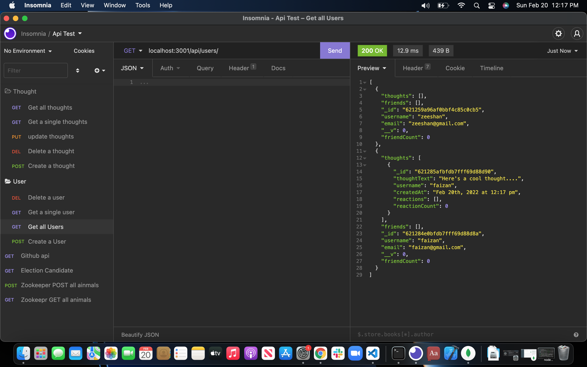

# NoSQL Social Network API 

  ## Table of Contents
  * [ Description ](#about)
  * [Video](#video)
  * [ Installation ](#installation)
  * [ Usage ](#usage)
  * [ Technologies ](#tech)
  * [ Questions ](#questions)

  ## Description
  API end routes set up for a social network that allows a user to create an account, add and remove thoughts and reactions to thoughts.
  

  ## Video
  Creating User, friends, thoughts and reactions (https://drive.google.com/file/d/139GooNxDfB2WrrG_4BgyrabnB0Msj8AC/view?usp=sharing)

  Delete All friends, reactions ,thoughts and users video (https://drive.google.com/file/d/1oLT0SVF0jeqtZPZWVCPxmcuu71ZjOXzK/view?usp=sharing)

  ## Technologies
  JavaScript\
  Node.js\
  Express.js\
  MongoDB\
  Mongoose

  ## Questions
Please feel free to email any questions to zeeshanahmedmufti@gmail.com.
